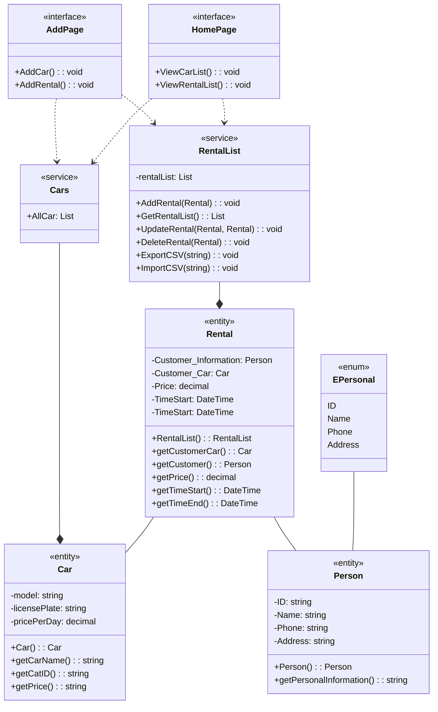

# Rental Car Management (โปรแกรมจัดการการเช่ารถ)
## ความเป็นมาของโปรแกรม
โปรแกรม Rental Car Management เป็นโปรแกรมที่ถูกออกแบบมาเพื่อบันทึกข้อมูลการเช่ารถของลูกค้าโดยพนักงาน โปรแกรมนี้ถูกสร้างขึ้นโดยใช้ภาษา C# และ Winform .Net standard เป็นเทคโนโลยีหลักในการพัฒนาโปรแกรม
โปรแกรมนี้สามารถบันทึกประวัติการเช่ารถของลูกค้าได้โดยการกรอกข้อมูลลูกค้าและข้อมูลการเช่ารถ เช่น ชื่อผู้เช่า เบอร์โทรศัพท์ ที่อยู่ รุ่นรถที่เช่าไป ป้ายทะเบียน ราคาต่อวัน ราคารวม ซึ่งข้อมูลทั้งหมดนี้จะถูกแสดงใน Datagridview เพื่อให้ผู้ใช้งานสามารถดูข้อมูลได้ง่ายและสะดวก
นอกจากนี้ โปรแกรมยังสามารถบันทึกข้อมูลทั้งหมดเป็นไฟล์นามสกุล csv ซึ่งเป็นไฟล์ที่ใช้สำหรับเก็บข้อมูลเป็นตาราง และยังสามารถเปิดไฟล์ที่บันทึกไว้นี้ได้อีกด้วย
โดยสรุปคือ โปรแกรม Rental Car Management เป็นโปรแกรมที่มีความสามารถในการบันทึกประวัติการเช่ารถของลูกค้า และแสดงข้อมูลเป็น Datagrid ซึ่งสามารถบันทึกไฟล์เป็น csv ได้และยังสามารถเปิดไฟล์ที่บันทึกไว้นี้ได้อีกด้วย ซึ่งจะช่วยให้พนักงานสามารถบริหารจัดการข้อมูลการเช่ารถของลูกค้าได้อย่างมีประสิทธิภาพ
## วัตถุประสงค์ของโปรแกรม
Rental Car Management คือโปรแกรมที่ช่วยให้พนักงานที่ดูแลการเช่ารถสามารถบันทึกประวัติการเช่ารถของลูกค้าได้อย่างสะดวกและรวดเร็ว และสามารถเก็บข้อมูลเช่ารถไว้ในระบบเพื่อนำมาใช้งานในภายหลังได้ โดยใช้ Datagridview เพื่อแสดงข้อมูลเช่น ชื่อผู้เช่า เบอร์โทรศัพท์ ที่อยู่ รุ่นรถที่เช่าไป ป้ายทะเบียน ราคาต่อวัน ราคารวม และสามารถบันทึกข้อมูลทั้งหมดเป็นไฟล์ CSV เพื่อเก็บข้อมูลไว้ใช้งานภายหลัง โดยผู้ใช้งานสามารถเปิดไฟล์ CSV เพื่อแสดงข้อมูลเช่ารถทั้งหมดที่เคยบันทึกไว้ก่อนหน้านี้ได้ง่ายๆ ด้วยการใช้โปรแกรมนี้ การใช้งานจะเป็นไปอย่างรวดเร็วและสะดวกสบายสำหรับผู้ใช้งานทั้งพนักงานและลูกค้า

# Mermaid
## Class diagram

## ผู้พัฒนาโปรแกรม
- [@RosinanteDev](https://github.com/armychawakorn)
- นายชวกร เนืองภา
- รหัสนักศึกษา 653450087-5
- นักศึกษาสาขาวิทยาการคอมพิวเตอร์และสารสนเทศ มหาวิทยาลัยขอนแก่น

